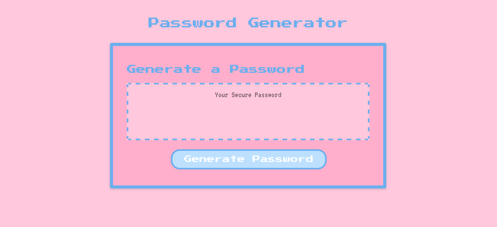

# Secure Password Generator

[Deployment Link](https://tykervella.github.io/Password-dot-com/)

---

## DESCRIPTION
A secure password generator. This webpage takes in user inputs to randomize a unique password. 

---

## INSTALLATION 

N/A

---

## USAGE

Upon clicking the "Generate Password" button, the user is prompted with what length of password to generate. If they enter a valid number, the user is then prompted with a series of yes or no questions on whether they want their password to include: uppercase letters, lowercase letters, numbers, and/or special characters. The program takes in all of the user inputs to generate a secure, randomized password using the parameters the user requested.

---

## CREDITS 

N/A

---

## LICENSE 

MIT License 
